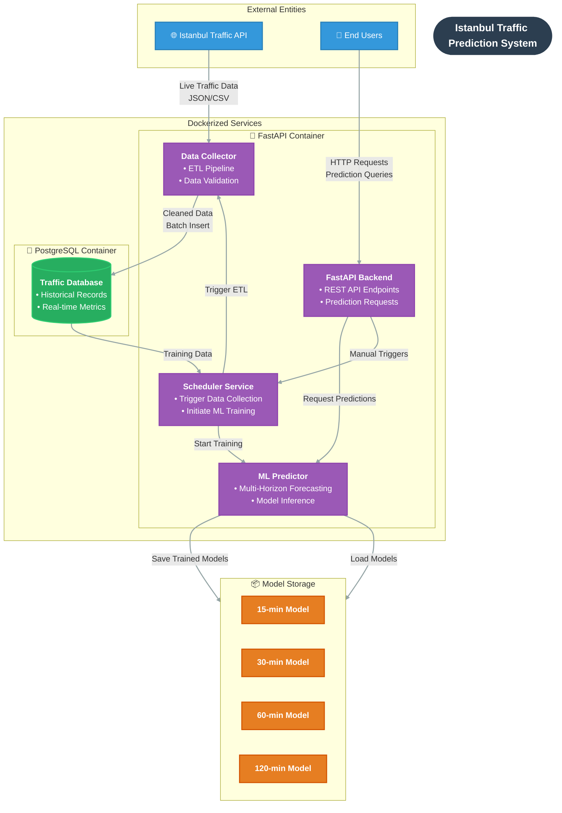

# Istanbul Municipality Traffic Prediction System

A comprehensive system for collecting, analyzing, and predicting Istanbul's traffic data using machine learning with advanced logging and model persistence.

## Architecture Overview




## Quick Start


1. **Clone and setup**:
   ```bash
   cd /home/utku/ibb-traffic-prediction
   ```

2. **Start services**:
   ```bash
   cd docker
   docker-compose up -d
   ```

3. **Access API**:
   - API: http://localhost:8000
   - API Docs: http://localhost:8000/docs

## API Endpoints

### Traffic Data
- `GET /` - Root endpoint
- `GET /health` - Health check
- `GET /traffic/latest?limit=10` - Get latest traffic data
- `GET /traffic/stats` - Get traffic statistics

### Predictions
- `GET /prediction` - Get legacy single-point traffic prediction (next minute)
- `GET /predictions` - Get multi-horizon traffic predictions (15, 30, 60, 120 minutes)

### Prediction Response Examples

**Legacy endpoint** (`/prediction`):
```json
{
  "prediction": 42,
  "timestamp": "2025-06-22T17:47:25.813456",
  "status": "prediction_available"
}
```

**Multi-horizon endpoint** (`/predictions`):
```json
{
  "predictions": {
    "15": 41,
    "30": 39,
    "60": 36,
    "120": 34
  },
  "timestamp": "2025-06-22T17:47:18.235315",
  "status": "predictions_available",
  "training_status": {
    "15": true,
    "30": true,
    "60": true,
    "120": false
  }
}
```

## Configuration

Configuration is managed in `config.py`:

- `TRAFFIC_API_URL`: Istanbul Municipality API endpoint
- `DATA_FETCH_INTERVAL`: Data collection interval (60 seconds)
- `ML_TRIGGER_THRESHOLD`: ML training trigger (10 data points)
- `DATABASE_URL`: PostgreSQL connection string

## Database Schema

```sql
CREATE TABLE traffic_data (
    id SERIAL PRIMARY KEY,
    inserted_timestamp TIMESTAMP DEFAULT NOW(),
    ti INTEGER NOT NULL,
    ti_an INTEGER NOT NULL,
    ti_av INTEGER NOT NULL
);
```

## Machine Learning

### Multi-Horizon Prediction System
- **Algorithm**: Separate Random Forest Regressor models for each time horizon
- **Horizons**: 15, 30, 60, and 120-minute predictions
- **Features**: Enhanced feature engineering with:
  - Lag features (1, 2, 3 minutes back) for TI, TI_AN, TI_AV
  - Time-of-day features (hour, minute)
  - Day-of-week patterns
  - Rolling averages and statistical measures

### Training Requirements
- **15-minute horizon**: Minimum 20 data points
- **30-minute horizon**: Minimum 35 data points  
- **60-minute horizon**: Minimum 65 data points
- **120-minute horizon**: Minimum 125 data points
- **Training Trigger**: Every 10 new data points collected
- **Model Persistence**: Automatic saving/loading with performance metrics

## Monitoring

- Health check endpoint for service monitoring
- Comprehensive logging for debugging
- Database connection health checks

### Code Quality

Before pushing code, run the linting script:

```bash
# Auto-format and fix all linting issues
./lint.sh
```


### Configuration Files

- **pyproject.toml**: Project configuration with Ruff and pytest settings
- **requirements.txt**: Production dependencies
- **lint.sh**: Linting and code quality script

### Code Style Guidelines

- **Line length**: 100 characters maximum
- **Import organization**: Automated with Ruff's isort functionality
- **Formatting**: Handled by Ruff formatter
- **Linting**: Comprehensive checks with Ruff
